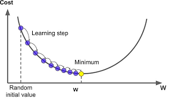

# Градиентное обучение

## Линейная регрессия: точное решение

Вспомним, что задачу машинного обучения сводят к задаче минимизации эмпирического риска $Q(h(x, \theta), D)$ где
$$
Q_{\text{emp}}(h) = \frac{1}{N}\sum_{i=1}^{N}L(h(x_i, \theta), y_i)
$$

В формуле выше $D$ - это накопленный опыт, то есть обучающая выборка а $h(x, \theta)$ - семейство функций, среди которых ищем решение.

лучшую модель $\hat{h}$ из семейства $h$ мы находим как точку, в которой эмпирический риск достигает минимума.  
$$
\hat{h} = \arg\min Q_{\text{emp}}(h, \theta)
$$

Точка минимума эмпирического риска является решением уравнения
$$
\frac{\partial Q_{\text{emp}}}{\partial h} = 0
$$

Применительно к задаче **линейной регресии** получаем следующее: хотим восстановить функцию $h(x_i)$ в виде *линейной комбинации* (т.е. суммы с некоторыми весами "важности") признаков объекта $(x_1,\ldots, x_n)$. Сами признаки называются *предикторами*:

$$
\forall x_i: h(x) = w_0 + w_1x_i^1 + \ldots + w_nx_i^n = \sum_{j=1}^{n}w_jx_i^j = \overline{x}_i^T\overline{w}
$$

Обратим внимание на специальный признак $w_0$ - он называется intercept. Позволяет более точно решать задачу, как видно по картинке


Мера качества $L$ для задачи регрессии - квадрат разности между фактическим значением и прогнозом. 
$$
L(h(x_i, \theta), y_i) = \left(y_i - h(x_i, \theta)\right)^2 = \left(y_i -  \sum_{j=1}^{n}w_jx_i^j\right)^2
$$

Тогда эмпирический риск вычисляется по формуле:
$$
Q_{\text{emp}} = \frac{1}{N}\sum_{i=1}^{N}(y_i - \hat{y_i})^2 = \frac{1}{N}\sum_{i=1}^{N}(y_i - \overline{x}_i^T\overline{w})^2 = \frac{1}{2N}||\overline{Y}-\overline{X}^T\overline{w}||^2 = \frac{1}{2N}\left(\overline{Y}-\overline{X}^T\overline{w}\right)^T\left(\overline{Y}-\overline{X}^T\overline{w}\right)
$$

Такой вид функции потерь называется RSS - *resudal squares sum*, на русский переводится как *остаточная сумма квадратов*. Нам нужно найти оптимальное значение весов $w_1,\ldots,w_n$

Вспомним, что $\hat{y_i}$ - ответ нашего алгоритма машинного обучения $h(x, \theta)$ на примере $x_i$. Чем *больше* значение функции потерь $L$ (т.е. чем *ближе оно к нулю*, т.к. берём со знаком минус) тем лучше наша модель повторяет опыт (в виде матрицы объекты-признаки) $X \in m \times n$ где $m$ - количество примеров в обучающей выборке, а $n$ - размерность пространства признаков. $w$ - это вектор параметров модели, который хотим обучить.

Мимнимум эмпирического риска можно найти аналитически, он достигается в точке $\overline{w}$
$$
\overline{w} = \left(X^TX\right)^{-1}X^T\overline{y}
$$

В [домашней работе](../jypyter_notebooks/Part_II_gradient_descent.ipynb) мы запрограммируем такое решение с помощью numpy и сравним его с готовым решением из sklearn.

## Линейная регрессия: алгоритм градиентного спуска

У аналитического решения есть ряд недостатков
* вычислительная сложность алгоритма матричного перемножения составляет $O(n^3)$, где $n$ - размерность матрицы. При увеличении размерности матрицы в 10 раз сложность вычислений увеличивается в $10^3=1000$ раз
* **неустойчивость вычислений** - пытаемся найти обратную матрицу, которая может не существовать, в этом случае в алгоритме нахождения обратной матрицы возникает деление на ноль

С неустойчивостью вычислений, например, связано предупреждение **LinAlgWarning:**. Пример такой "неудачной" матрицы:
$$
X^TX = 
\left[
\begin{array}{cc}
5 & 25 \\
2 & 10 
\end{array}
\right]
$$

Допустим, хотим вычислить коэффициенты аналитически. Если попытаемся найти обратную матрицу $(X^TX)^{-1}$, мы получим сообщение об ошибке - попробуйте запустить код ниже - увидите ошибку `LinAlgError: Singular matrix`.
```python
import numpy as np

# матрица из примера
X = np.array([
    [5, 25],
    [2, 10]
])
# пытаемся найти обратную
np.linalg.inv(X)
```

Это очень печально - значит, мы не всегда можем применять аналитическую формулу $\overline{w} = \left(X^TX\right)^{-1}X^T\overline{y}$ для нахождения коэффициентов $\overline{w}$ Как же быть, если задачу решать все равно надо?

Решение этих проблем нашли математики - давайте вычислять коэффициенты линейной регрессии не аналитически, а с помощью приближённых численных методов. Тогда не надо будет перемножать матрицы или находить обратные матрицы. Самый простой и эффективный из этих методов называется методом *градиентного спуска*. Суть метода состоит в обновлении параметров модели $w$ по маленьким шажкам (вместо того, чтобы находить их сразу) - это и есть градиентный спуск.

Каждый такой шажок назвается "итерация".

Мы знаем, что коэффициенты обучаются при помощи минимизации функции ошибок:

$$
L(y,w) = \sum_{i=1}^{N}\left(y_i - \hat{y_i}\right)^2
$$

Эта функция квадратичная - следовательно, имеет форму параболы. Минимум параболы соответствует минимуму ошибки - давайте как-то понемногу "подкручивать" параметры, чтобы по шажкам спуститься в точку, где ошибка будет минимальной - в этой точке и находятся параметры $w$, которые мы ищем. Правила обновления весов должны быть очень простыми и не содержать матричных перемножений



В трёхмерном случае картинка более красивая - мы движемся как бы ландшафту и хотим найти самую нижнюю точку на этом ландшафте:


На семинаре мы запустим шажки градиентного спуска (те самые итерации) - для этого используем готовый класс [SGDRegressor](https://scikit-learn.org/stable/modules/generated/sklearn.linear_model.SGDRegressor.html) и функцию [partial_fit](https://scikit-learn.org/0.15/modules/scaling_strategies.html#incremental-learning)

"Маленькие шажки", которыми мы двигаемся к оптимальному решению в виде формулы выглядят следующим образом:
$$
w^{k+1} = w^k - \eta\nabla L(w)
$$
Переменная $\eta$ в формуле - т.н. *шаг градиентного спуска*. $\nabla L(w)$ - вектор градиента функции. Этот вектор обладает следующими свойствами: 

* имеет размерность вектора параметров. Если у модели два параметра $[w_0, w_1]$ - в векторе градиента будет два элемента
* элемент градиента под номером $i$ - это частная производная (вспоминаем математику за 11 класс и [смотрим в Википедию](https://ru.wikipedia.org/wiki/Производная_функции ) ) функции потерь $L(y, w)$ по параметру $w_i$

Вектор антиградиента всегда направлен в сторону уменьшения функции - в этом и есть всё волшебство! Мы будем двигаться в сторону минимума функции ошибки, потому что знаем как туда попасть - надо следовать по антиградиенту.

На картинке одномерный случай. Синяя стрелка - градиент, красная - антиградиент. Видно, что если двигаться по вектору антиградиента, то свалимся в минимум функции за конечное число шагов


Алгоритм визуально выглядит довольно интуитивно - (1) у нас есть вектор-стрелочка (2) шагай по стрелочке, пока не попадёшь в финальную точку, которая представляет собой минимум целевую функцию. В трёхмерном случае оптимальное значение функции находится в центре концентрицеских эллипсов (эллипс - проекция трёхмерной фигуры функции потерь на плоскость):


Как туда добраться, двигаясь маленькими шажками?

1. Стартуем алгоритм в случайной начальной точке $x^0$  
1. Вычисляем направление антиградиента $-f'(x^0)$ (буквально: производная со знаком "минус")
1. Перемещаемся по направлению градиента в точку $x^1 = x^0 - \eta f'(x^0)$
1. Повторяем шаги (1-3) для попадания в точку $x^2$
1. $\ldots$
1. Profit! Достигли оптимальной точки $x^*$

Алгоритм выше - универсальный, он позволяет найти точку минимума любой функции $f(x)$. А как же нам найти минимум функции качества линейной регрессии $L$

$$
L(y,w) = \sum_{i=1}^{N}\left(y_i - \hat{y_i}\right)^2
$$

Чтобы реализовать алгоритм градиентного спуска, выпишем частные прозводные функции качества линейной регрессии $L$ для параметров $\overline{w} = [w_1,\ldots,w_m]$ в простейшем случае $n=1$, то есть для одного обучающего примера (одного наблюдения):
$$
\left\{
\begin{array}{cc}
\frac{\partial L}{\partial w_0} = 2\cdot(-1)\cdot1\cdot (y_1 - (w_0x_0^1 + \ldots+w_mx_m^1)) &\\
\frac{\partial L}{\partial w_k} = 2\cdot(-1)\cdot x_1^1 \cdot (y_1 - (w_0x_0^1 + \ldots+w_mx_m^1)) &  k\neq 0\\
\end{array}
\right.
$$

В формуле все обозначения вам известны

* $w_0, \ldots, w_m$ - коэффициенты линейной регрессиии $m$ - количество фичей
* $x_0, \ldots, x_m$ - фичи.

Эту формулу с частными производными можно легко обобщить на случай, когда в обучающей выборке не один объект, а $n$ - просто добавляем сумму по всем объектам от 1 до $n$:
$$
\left\{
\begin{array}{cc}
\frac{\partial L}{\partial w_0} = \frac{2}{n}\cdot(-1)\cdot \sum_{i=1}^{n} 1\cdot \left(y_i - \sum_{j=1}^{m}w_jx_j^i\right) &\\
\frac{\partial L}{\partial w_k} = \frac{2}{n}\cdot(-1)\cdot \sum_{i=1}^{n} x_k^i \cdot\left(y_i - \sum_{j=1}^{m}w_jx_j^i\right) & k\neq 0 \\
\end{array}
\right.
$$

Что значат переменные в этой формуле?
* $n$ - число точек в обучающей выборке
* $m$ - число фичей в датасете
* $k$ - номер коэффициента в списке параметров линейной регрессии $w = [w_0,\ldots,w_m]$
* $y_i$ - значение целевой переменной на объекте обучающей выборки под номером $i$
* $x_j^i$ - значение фичи под номером $j$ на объекте обучающей выборки под номером $i$

Алгоритм градиентного спуска следующий:

1. Вычислить градиент $\nabla L(w)$
1. Вычислить новый вектор  $w^{k+1} = w^k - \eta\nabla L(w)$
1. Повторять пункты до тех пор, пока $w^{k+1}$ и $w^{k}$ не сойдутся вместе, то есть вектор весов перестанет обновляться

Чтобы лучше понять этот метод, на семинаре реализуем его "с нуля" на языке Python

**Особенности градиентного спуска**

1. Нужно подбирать параметр $\eta$. Еcли выбрать параметр слишком малым, то обучение регрессии будет происходить слишком медленно. Если слишком большим - вычисления не сойдутся к оптимуму. Вариант решения - адаптивный выбор величины шага
1. Долгие вычисления, если размер выборки $n$ становится большим. В этом случае мы можем вычислять градиент не по всей выборке за один шаг, а по одному случайному элементу выборки - в этом случае вычислений значительно меньше.

Кроме того, градиент можно считать не только по одному объекту, но и по случайной подвыборке (батчу). Такая модификация алгоритма называется градиентным спуском по мини-батчам.


Хорошая теория [тут](http://www.machinelearning.ru/wiki/images/6/68/voron-ML-Lin.pdf). Неплохая статья с разбором [формул обновления весов](https://medium.com/@lachlanmiller_52885/machine-learning-week-1-cost-function-gradient-descent-and-univariate-linear-regression-8f5fe69815fd). Видео от [специализации ШАД на coursera](https://ru.coursera.org/lecture/supervised-learning/gradiientnyi-spusk-dlia-linieinoi-rieghriessii-adARX)
